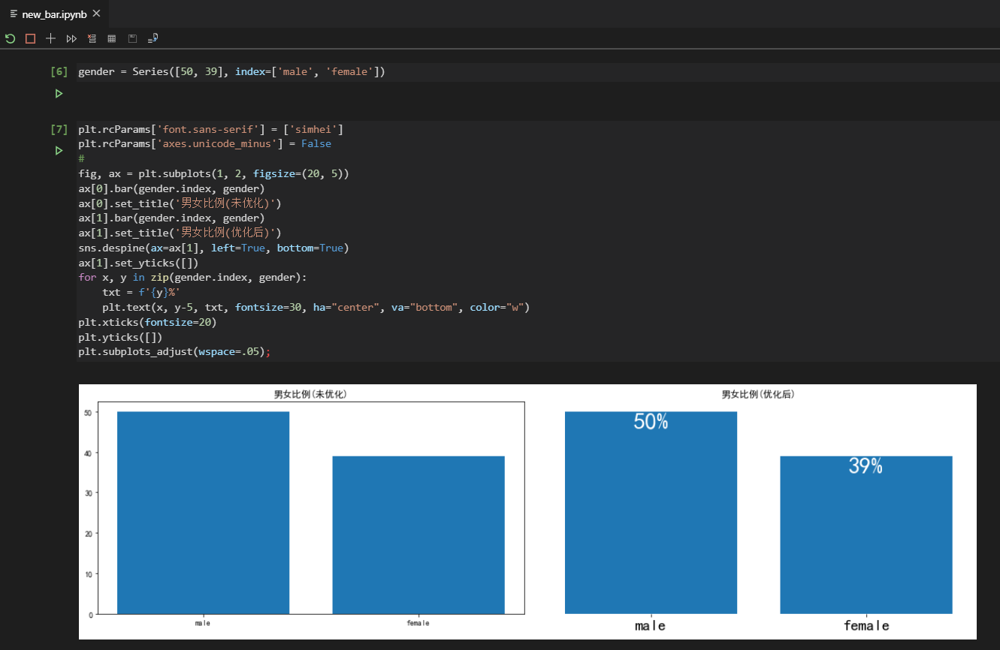

 # 1，new_bar.ipynb 说明
 ### Q: 如何做出一个"足够简洁又美观"的可视化图？
 ### A: 足够简洁又美观是可视化的趋势，比如，在内容足以显示数据的情况之下，可以省略掉一些不必要的坐标轴等冗余信息，在这里，我以python代码，举一个柱状图为例：
##### 1，以Series手动创建一个用来表示分类数据的原始数据。
##### 2，分类数据适合用bar图或pie图，bar图更常见。
##### 3, matplotlib本身做不到"简洁"的效果，比如去除框线，所以还需要使用seaborn。
##### 4, 使用plt.subplots()创建一个1行2列的子图，方便用来显示左右对比，左图是没有经过优化的"不简洁"图，右图是经过优化后的"简洁又美观"的图。
##### 5，使用plt.text()来标注条柱上对应的值，这里遍历Series对象的index和values，第1个参是是"位置"，第二个参数是"高度值"，第三个参数是对应的"label"名，参数va是垂直排列，ha是水平排列。
##### 6，使用seaborn的despine()函数，删除掉所有的框线，同时使用plt.yticks()去掉y轴，加上title等，代码部份，请参考下图，很明显，右图就是"足够简洁又美观的图"。

        
 
